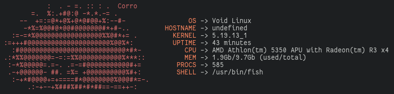
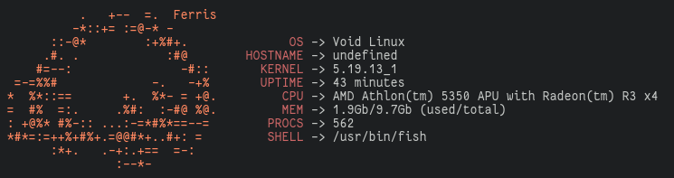

How to install(you need cargo):
```
cargo install crabfetcher
```

```
crabfetcher --ferris => Use ferris ascii art.
crabfetcher --corro  => Use corro ascii art.

You can use crabfetcher -c or crabfetcher -f too!
```

<h3>Corro ascii art</h3>



<h3>Ferris ascii art</h3>

